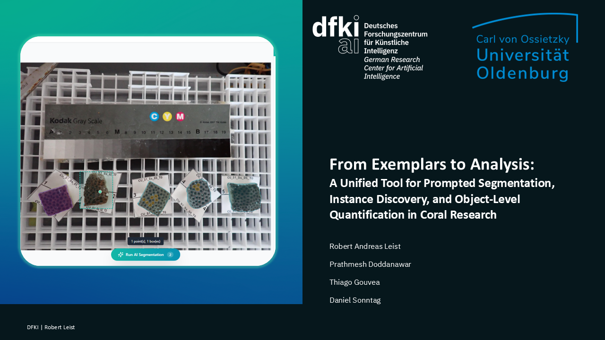

# IQUANA (Image Quantification and Analysis)

**IQUANA** is an interactive, open-source tool co-developed with marine ecologists to streamline image annotation and analysis in fields like marine ecology. It addresses the bottleneck of manual processes by leveraging state-of-the-art computer vision models for detailed object-level quantification.

---

## 🎬 Demo Video

[](https://dfkide-my.sharepoint.com/:v:/g/personal/role01_dfki_de/IQAGAHqvai8tS4_1TRPNgQFVAWqFdM53Z5_sVYn9nE8NZII?e=rfB36S)

> **Note:** If the link above does not open, please ensure you have the necessary permissions to view the SharePoint resource.

---

## 🚀 Key Features

* **AI-Assisted Efficiency**: Provides streamlined workflows that integrate AI at multiple stages to improve annotation speed and quality.
    1.  **Prompted Segmentation**: Generates detailed instance masks from simple inputs like points or bounding boxes. IQUANA integrates the **SAM 2.1** model for this purpose.
    2.  **Exemplar-based Instance Discovery**: Finds target objects by providing exemplary instances of the target class. This is powered by **SAM 3** and **GeCo**.
    3.  **Semantic Segmentation**: Predicts labels for every pixel based on a defined classification scheme. Integrated networks include **UNet**, **DeepLab**, and their extensions.
* **Nested Object Structures**: Utilizes a novel data model that supports hierarchical relationships between organisms and their morphological features (e.g., relating polyps to specific corals).
* **User-Centric Design**: Features a modern, accessible interface tailored specifically for non-ML domain experts.
* **Object-Level Data**: Saves annotations with hierarchy information to enable nested segmentation for improved downstream analysis.

---

## 🏗 Software Architecture

Designed with a modular microservice architecture, IQUANA prioritizes scalability and maintainability.

* **Frontend**: A high-fidelity system created using JavaScript and React.js.
* **Backend**: Written in Python using **FastAPI** to simplify the integration of modern AI models.
* **Task Management**: Uses **Celery**, a task distribution queue framework, to manage long-running tasks like model training or inference across multiple images.
* **Deployment**: Everything is **Dockerized**, allowing for local or cloud deployment to ensure accessibility for different labs.

---

## 📊 Preliminary Results

Initial usability tests with marine ecologists showed:
* **Usability**: A System Usability Scale (SUS) score of **85**.
* **Cognitive Load**: A low raw NASA-TLX score of **20**.
* **Efficiency**: Users described prompted segmentation as "way better and faster" than traditional manual approaches.

---

## 📂 Access & Licensing

* **Code**: Available at [https://github.com/Iquana-tool](https://github.com/Iquana-tool)
* **License**: Licensed under **AGPL**

---

## 📖 Citation

If you use IQUANA in your research, please cite our work:

```bibtex
@inproceedings{leist2026iquana,
  title={From Exemplars to Analysis: A Unified Tool for Prompted Segmentation, Instance Discovery, and Object-Level Quantification in Coral Research},
  author={Leist, Robert Andreas and Doddanawar, Prathmesh and Gouvêa, Thiago S. and Sonntag, Daniel},
  booktitle={Proceedings of the 35th International Joint Conference on Artificial Intelligence (IJCAI-26)},
  year={2026}
}


Video Showcase: Link to Video.
